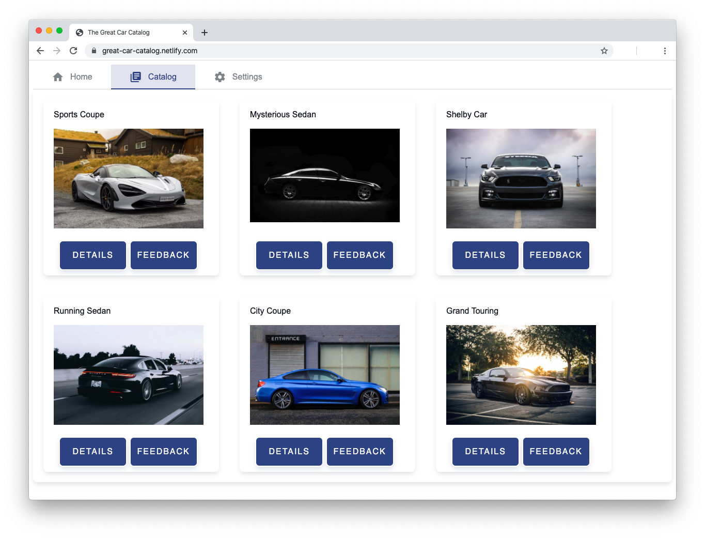

This repository contains a Node.js project implementing a simple API that accepts anonymous product reviews after applying a spam filter based on [Auth0 Signals](https://auth0.com/signals/ip).

The following article describes the implementation details: [Block Spam with Auth0 Signals](https://auth0.com/blog/block-spam-auth0-signals/)

## To run the application:

Clone the repo: `git clone https://github.com/auth0-blog/review-server-no-spam.git`

To run the server:

1. Move to the `review-server-no-spam` folder 
2. Type `node server` in a terminal window (the server should be listening at the [http://localhost:3000](http://localhost:3000 ) address)

To run the sample client application:

1. Point your browser to [https://great-car-catalog.netlify.com/](https://great-car-catalog.netlify.com/)
2. Move to the `Settings` section and set `http://localhost:3000` as the Server URI
3. Move to the `Catalog` section and add a feedback to one of the items displayed

## Requirements:

- [Node.js 12.*](https://nodejs.org/) installed on your machine

  

